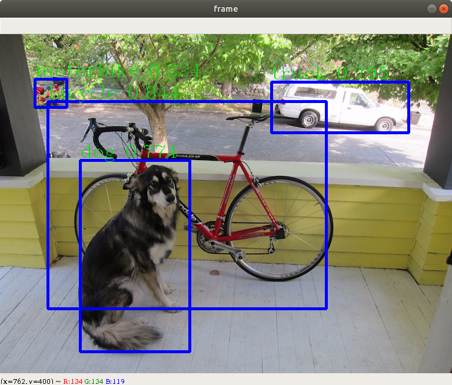

# DarkFlow

## __Dependencies__

#### Python3 :

```
sudo apt-get update
sudo apt-get upgrade         
sudo apt-get install python3.6
python3 --version
```
Result:

```
Python 3.6.9
```

#### Pip3 : 

```
sudo apt-get installpython3-pip
pip3 --version
```
Result:

```
pip 20.0.2 from /usr/local/lib/python3.6/dist-packages/pip (python 3.6)
```

#### Opencv3 : 

```
pip3 install opencv-python
git clone https://github.com/opencv/opencv.git
git clone https://github.com/opencv/opencv_contrib.git
```

#### Cython :

```
pip3 install Cython
```

#### Numpy :

```
pip3 install numpy
```

#### Tensor flow 1.0 :

```
pip3 install tensorflow==1.0.0 
```

#### Check if python dependencies are installed :

```
python3
>>> import cv2
>>> cv2.__version__ 
'4.2.0'
>>> import numpy
>>> numpy.__version__
'1.18.1'
>>> import tensorflow as tf
>>> tf.__version__
‘1.0.0'
>>> import cython
>>> cython.__version__
‘0.29.15’
>>> quit()
```

#### DateTime :

```
pip3 install DateTime
```

## __Darkflow__

```
sudo apt install git
git clone https://github.com/thtrieu/darkflow.git
cd darkflow
python3 setup.py build_ext –inplace
pip install .
```

Go to

https://drive.google.com/drive/folders/0B1tW_VtY7onidEwyQ2FtQVplWEU

Download yolo.weights, create a folder bin and move yolo.weights in the folder.

<p align="center">  </p>

To see if everything is correctly installed you can try
```
python3 test.py
```

If the program display this image then darkflow is installed.

<p align="center">  </p>

#### Command :
```
python3 YoLo_Cam.py
```

You can also run the program with this command which restart if it crash of any other error.

```
chmod 777 YoLo_Cam.sh
./YoLo_Cam.sh
```

If you want to use more cameras you can add cameras path in the video_path file and go to YoLo_Cam.py and change this line with the number of your camera

```
47  # Number of cameras
48  nbCam = 3
```
